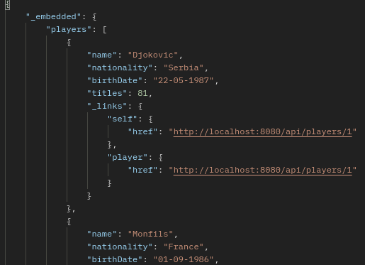
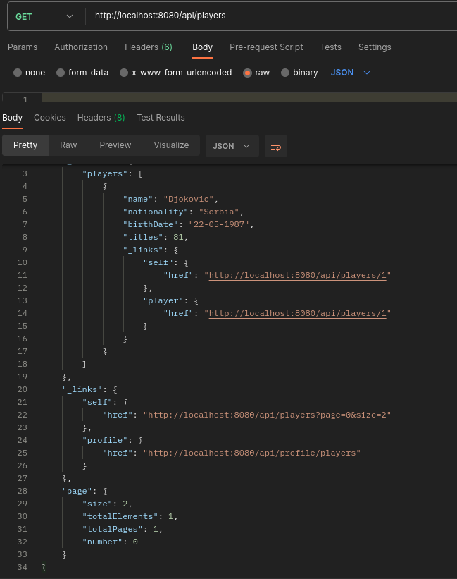

# Spring-Data-REST

Spring Data REST is a project similar to Spring Data JPA which aims to eliminate boilerplate code. With Spring Data JPA,
we get the basic CRUD functionality without writing any code simply by specifying the entity and the type of primary
key.

Similarly, Spring Data REST provides a REST API based on the repository and entity without us having to write any code
in the controller and service layer. It uses the repository to expose endpoints to perform GET, POST, PUT, PATCH and
DELETE on every entity in the application. Spring Data REST works with data sources implementing the repository
programming model. It supports Spring Data JPA, Spring Data MongoDB, Spring Data Cassandra as well as other Spring Data
projects.

Spring Data REST creates endpoints using the entity name by making the first letter lowercase and adding an ‘s’ to the
end of the name. For example, we have the following repository interface:

    public interface PlayerRepository extends JpaRepository<Player, Integer> {
    }

Spring Data REST will convert the entity name Player to its uncapitalized, pluralized form players and expose the REST
endpoints at /players. It also exposes /players/{id} for each item managed by the repository.

This what we need to add to pom.xml:

    <dependency>
        <groupId>org.springframework.boot</groupId>
        <artifactId>spring-boot-starter-data-rest</artifactId>
    </dependency>

## **_HATEOAS_**

HATEOAS (Hypermedia as the Engine of Application State) is a principle of RESTful API design that aims to enhance the
discoverability and navigability of APIs by including hypermedia links in the API responses.

In a HATEOAS-compliant API, each response from the server not only contains the requested data but also includes links
to related resources and actions that can be performed on those resources. These hypermedia links provide clients with
the necessary information to navigate the API and discover available functionality dynamically.

By following HATEOAS principles, API clients can be decoupled from the server's URI structure and can interact with the
API based on the provided hypermedia links. This enables flexibility and adaptability to changes in the API without
breaking client implementations.

## **_Customization_**

Spring Data REST allows for customization of the REST API through a number of properties:
*   Base Path
*   Sorting
*   Paging
*   Resource name

...

we can customize all of this.